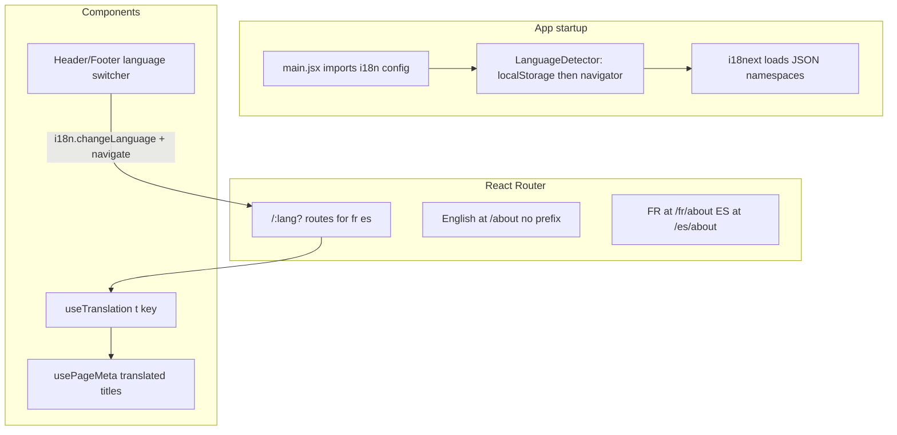

# Multilingual New Site with i18next

## Short answer: yes, you can use this stack

These packages work well with your current setup (React 19 + Vite + react-router-dom):

| Package | Version you listed | Role in this project |
|---------|-------------------|----------------------|
| `i18next` | ^25.8.18 | Core translation engine and locale state |
| `react-i18next` | ^16.5.8 | `useTranslation()` hook in components |
| `i18next-browser-languagedetector` | ^8.2.1 | Detect browser language on first visit + persist choice |

Install:

```bash
npm install i18next react-i18next i18next-browser-languagedetector
```

No conflict with existing dependencies ([`package.json`](package.json) has no i18n library today).

---

## Scope (confirmed)

**In scope** — everything under [`NewHomeLayout`](src/components/layouts/NewHomeLayout.jsx):

- Home, About, Methodology, Case Studies, Insights, Contact
- Case study + insight detail pages
- Terms + Privacy (new versions)
- Header, footer, mobile menu, all NewHome/About/Methodology/Contact/Insights/CaseStudies components

**Out of scope** — legacy [`Layout`](src/components/layouts/Layout.jsx) routes: Insurance, Old home, Book consultation, etc.

---

## Recommended architecture



### 1. i18n bootstrap — new file [`src/i18n/index.js`](src/i18n/index.js)

```js
import i18n from 'i18next'
import { initReactI18next } from 'react-i18next'
import LanguageDetector from 'i18next-browser-languagedetector'

i18n
  .use(LanguageDetector)
  .use(initReactI18next)
  .init({
    fallbackLng: 'en',
    supportedLngs: ['en', 'fr', 'es'],
    ns: ['common', 'home', 'about', 'methodology', 'caseStudies', 'insights', 'contact', 'legal', 'meta'],
    defaultNS: 'common',
    detection: {
      order: ['localStorage', 'navigator', 'htmlTag'],
      caches: ['localStorage'],
      lookupLocalStorage: 'i18nextLng',
    },
    interpolation: { escapeValue: false },
  })
```

Import this once in [`src/main.jsx`](src/main.jsx) before `<App />`.

### 2. How `LanguageDetector` fits

`i18next-browser-languagedetector` handles:

- **First visit**: reads browser language (`navigator.language`) — e.g. `fr-CA` maps to `fr`
- **Return visits**: reads saved choice from `localStorage` (`i18nextLng`)
- **Language switch**: when user picks FR/ES in header or footer, call `i18n.changeLanguage('fr')` — detector cache keeps it on reload

**Important pairing with URLs** (recommended for SEO and shareable links):

- English (default): `/about`, `/insights/slug`
- French: `/fr/about`, `/fr/insights/slug`
- Spanish: `/es/about`, `/es/insights/slug`

On route change, sync i18n with URL:

```js
// e.g. in a LocaleLayout wrapper
const { lang } = useParams() // undefined | 'fr' | 'es'
useEffect(() => {
  i18n.changeLanguage(lang ?? 'en')
  document.documentElement.lang = lang ?? 'en'
}, [lang])
```

On language switch, navigate to the same page in the new locale (not only `changeLanguage`).

Detector + URL together gives: smart first visit, persistent preference, and clean permalinks.

### 3. Routing changes — [`src/App.jsx`](src/App.jsx)

Wrap `NewHomeLayout` routes in an optional locale segment:

```jsx
<Route path="/" element={<NewHomeLayout />}>
  <Route index element={<Home />} />
  <Route path="about" element={<About />} />
  {/* ...existing English routes unchanged... */}
</Route>

<Route path="/:lang" element={<LocaleGuard />}>
  <Route element={<NewHomeLayout />}>
    <Route index element={<Home />} />
    <Route path="about" element={<About />} />
    {/* mirror all new-site routes */}
  </Route>
</Route>
```

Add [`src/components/LocaleGuard.jsx`](src/components/LocaleGuard.jsx) — only allows `fr` and `es`; invalid codes 404.

Alternative (less duplication): single route tree with optional `:lang?` param and one set of child routes.

### 4. Translation file structure

```
src/locales/
  en/
    common.json      # nav, footer, CTAs, buttons
    meta.json        # page titles/descriptions
    home.json
    about.json
    methodology.json
    caseStudies.json
    insights.json
    contact.json
    legal.json
  fr/
    (same files)
  es/
    (same files)
```

Load via `i18next` resources or `import.meta.glob` in Vite.

**Long-form content** ([`insightsArticles.js`](src/lib/insightsArticles.js), [`caseStudyContent.js`](src/lib/caseStudyContent.js)) — largest effort:

- Option A: separate files per locale — `insightsArticles.fr.js`, `insightsArticles.es.js`
- Option B: one file per article with `{ en, fr, es }` nested objects
- Data accessors become locale-aware: `getInsightBySlug(slug, lang)`

Legal pages ([`NewTermsOfService.jsx`](src/pages/NewTermsOfService.jsx), [`NewPrivacyPolicy.jsx`](src/pages/NewPrivacyPolicy.jsx)) — move `SECTIONS` arrays into `legal.json` per locale.

### 5. Component migration pattern

Replace hardcoded strings:

```jsx
// Before
<span>Book a Call</span>

// After
const { t } = useTranslation('common')
<span>{t('header.bookACall')}</span>
```

Shared navigation in [`NewHomeHeader.jsx`](src/components/layouts/NewHomeHeader.jsx), [`NewHomeFooter.jsx`](src/components/layouts/NewHomeFooter.jsx), [`NewHomeMobileMenu.jsx`](src/components/layouts/NewHomeMobileMenu.jsx) — translate `NAV_LINKS` labels and wire language switcher (replace static "English" button + footer FR/ES placeholders).

Add helper [`src/lib/localePath.js`](src/lib/localePath.js):

```js
export function localizedPath(path, lang) {
  if (!lang || lang === 'en') return path
  return `/${lang}${path}`
}
```

Use in a thin `LocaleLink` wrapper around `react-router-dom` `Link`.

### 6. Meta tags — [`usePageMeta.js`](src/hooks/usePageMeta.js)

Replace hardcoded `HOME_META` etc. with:

```js
const { t } = useTranslation('meta')
usePageMeta({ title: t('home.title'), description: t('home.description') })
```

Re-run meta when language changes (`i18n.language` in effect deps).

### 7. Language switcher UX

Header globe button ([`NewHomeHeader.jsx`](src/components/layouts/NewHomeHeader.jsx) line 94–101) and footer FR/ES buttons ([`NewHomeFooter.jsx`](src/components/layouts/NewHomeFooter.jsx) line 228–239):

- Dropdown or buttons: English | Français | Español
- On select: `i18n.changeLanguage(code)` + `navigate(localizedPath(currentPath, code))`
- Show current language label from `i18n.language`

---

## Implementation phases

### Phase 1 — Foundation (infrastructure)
- Install packages
- Create `src/i18n/index.js` with `LanguageDetector`
- Add locale routing + `LocaleGuard` + `localizedPath` helper
- Wire header/footer language switcher
- Add `en/common.json` + empty `fr`/`es` stubs

### Phase 2 — UI strings (all new-site components)
- Migrate nav, footer, CTAs, section headings, forms, FAQs
- Add `meta.json` for all page titles/descriptions (EN first, then FR/ES)

### Phase 3 — Long-form content
- Restructure insights + case studies for multi-locale data
- Translate articles and case study bodies (largest content volume)
- Legal pages (Terms, Privacy)

### Phase 4 — Polish
- Set `<html lang="...">` on locale change
- Fallback to English if a FR/ES key is missing (`fallbackLng: 'en'`)
- Verify internal links preserve locale
- Optional: `hreflang` link tags in `index.html` or dynamic head for SEO

---

## What you need to provide

For a complete FR/ES site, translation copy is required for:

- ~10 page UI surfaces (home sections, about, methodology pillars, etc.)
- 3 insight articles (very long)
- 3 case studies (very long)
- Terms + Privacy legal text

If copy is not ready yet, Phase 1–2 can ship with English complete and FR/ES falling back to English until JSON files are filled.

---

## Risks / notes

- **Content volume**: insights + case studies are 80%+ of translation work; UI shell is faster.
- **Slug strategy**: keep English slugs in all locales (`/fr/insights/the-90-day-ai-roadmap`) unless you want translated URLs (more complex).
- **Detector alone is not enough**: without URL sync, shared links always open in English; URL + detector is the right combo.
- **react-router v7**: locale param must not conflict with existing routes like `/case-studies/:slug` — use `/:lang(fr|es)?` guard or nested structure carefully.
